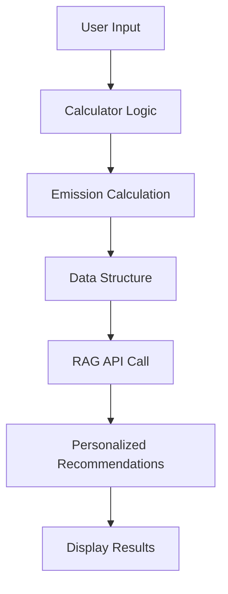

# 🧮 Calculator Integration Guide

This guide explains how to integrate different carbon footprint calculators with the GreenPulse RAG recommendation system.

## 📋 Table of Contents

1. [Overview](#overview)
2. [Travel Calculator](#travel-calculator)
3. [Household Calculator](#household-calculator)
4. [Food Calculator](#food-calculator)
5. [Shopping Calculator](#shopping-calculator)
6. [Integration Examples](#integration-examples)
7. [Best Practices](#best-practices)

## 🎯 Overview

The RAG system accepts calculation data from various carbon footprint calculators and generates personalized recommendations. Each calculator type has a specific data structure that must be followed for optimal results.

### General Integration Flow



## 🚗 Travel Calculator

### Data Structure

```javascript
const travelData = {
  // Private transport (cars, motorcycles, trucks)
  privateTransport: [
    {
      vehicleType: "car",           // Required: car|motorcycle|truck
      distance: 50,                 // Required: km
      fuelType: "petrol",           // Required: petrol|diesel|electric
      passengers: 1,                // Optional: number of passengers
      fuelEfficiency: 12            // Optional: km/liter
    }
  ],
  
  // Public transport (buses, trains, LRT, MRT)
  publicTransport: [
    {
      transportType: "bus",         // Required: bus|train|lrt|mrt
      distance: 20,                 // Required: km
      frequency: "daily"            // Required: daily|weekly|monthly
    }
  ],
  
  // Flights
  flights: [
    {
      origin: "KUL",                // Required: IATA code
      destination: "SIN",           // Required: IATA code
      class: "economy",             // Required: economy|business|first
      passengers: 1                 // Optional: number of passengers
    }
  ]
}
```

### Emission Factors

| Vehicle Type | Fuel Type | Emission Factor (kg CO2e/km) |
|--------------|-----------|------------------------------|
| Car (Small) | Petrol | 0.192 |
| Car (Medium) | Petrol | 0.240 |
| Car (Large) | Petrol | 0.288 |
| Car (Small) | Diesel | 0.168 |
| Car (Medium) | Diesel | 0.210 |
| Car (Large) | Diesel | 0.252 |
| Motorcycle | Petrol | 0.072 |
| Bus | Diesel | 0.089 |
| Train | Electric | 0.041 |
| LRT | Electric | 0.035 |
| MRT | Electric | 0.030 |

### Integration Example

```javascript
// Vue.js Travel Calculator Component
export default {
  data() {
    return {
      privateTransport: [],
      publicTransport: [],
      flights: [],
      totalEmissions: 0
    }
  },
  
  methods: {
    addPrivateTransport() {
      this.privateTransport.push({
        vehicleType: 'car',
        distance: 0,
        fuelType: 'petrol',
        passengers: 1,
        fuelEfficiency: 12
      })
    },
    
    calculateEmissions() {
      let total = 0
      
      // Calculate private transport emissions
      this.privateTransport.forEach(vehicle => {
        const factor = this.getEmissionFactor(vehicle.vehicleType, vehicle.fuelType)
        const emissions = vehicle.distance * factor
        total += emissions
      })
      
      // Calculate public transport emissions
      this.publicTransport.forEach(transport => {
        const factor = this.getPublicTransportFactor(transport.transportType)
        const emissions = transport.distance * factor
        total += emissions
      })
      
      // Calculate flight emissions
      this.flights.forEach(flight => {
        const emissions = this.calculateFlightEmissions(flight)
        total += emissions
      })
      
      this.totalEmissions = total
      this.generateRecommendations()
    },
    
    async generateRecommendations() {
      const calculationData = {
        privateTransport: this.privateTransport,
        publicTransport: this.publicTransport,
        flights: this.flights
      }
      
      try {
        const response = await recommendationService.generateRecommendations({
          category: 'travel',
          emissions: this.totalEmissions,
          calculationData
        })
        
        this.recommendations = response.data
      } catch (error) {
        console.error('Failed to generate recommendations:', error)
      }
    }
  }
}
```

## 🏠 Household Calculator

### Data Structure

```javascript
const householdData = {
  // Electricity usage
  electricity: {
    monthlyKWh: 300,                // Required: monthly kWh consumption
    provider: "TNB",                // Required: TNB|other
    renewablePercentage: 0          // Optional: 0-100
  },
  
  // Water usage
  water: {
    monthlyCubicMeters: 15,         // Required: monthly water consumption
    hasWaterHeater: true,           // Optional: boolean
    hasSwimmingPool: false          // Optional: boolean
  },
  
  // Gas usage
  gas: {
    monthlyCubicMeters: 20,         // Required: monthly gas consumption
    type: "natural_gas"             // Required: natural_gas|lpg
  },
  
  // Waste generation
  waste: {
    weeklyKg: 10,                   // Required: weekly waste in kg
    recyclingPercentage: 30         // Optional: 0-100
  }
}
```

### Emission Factors

| Category | Factor | Unit |
|----------|--------|------|
| Electricity (TNB) | 0.0007 | kg CO2e/kWh |
| Electricity (Other) | 0.0008 | kg CO2e/kWh |
| Water | 0.0004 | kg CO2e/m³ |
| Natural Gas | 2.0 | kg CO2e/m³ |
| LPG | 1.5 | kg CO2e/m³ |
| Waste (Landfill) | 0.5 | kg CO2e/kg |
| Waste (Recycled) | 0.1 | kg CO2e/kg |

### Integration Example

```javascript
// Vue.js Household Calculator Component
export default {
  data() {
    return {
      electricity: {
        monthlyKWh: 0,
        provider: 'TNB',
        renewablePercentage: 0
      },
      water: {
        monthlyCubicMeters: 0,
        hasWaterHeater: false,
        hasSwimmingPool: false
      },
      gas: {
        monthlyCubicMeters: 0,
        type: 'natural_gas'
      },
      waste: {
        weeklyKg: 0,
        recyclingPercentage: 0
      },
      totalEmissions: 0
    }
  },
  
  methods: {
    calculateEmissions() {
      let total = 0
      
      // Electricity emissions
      const electricityFactor = this.electricity.provider === 'TNB' ? 0.0007 : 0.0008
      total += this.electricity.monthlyKWh * electricityFactor
      
      // Water emissions
      total += this.water.monthlyCubicMeters * 0.0004
      
      // Gas emissions
      const gasFactor = this.gas.type === 'natural_gas' ? 2.0 : 1.5
      total += this.gas.monthlyCubicMeters * gasFactor
      
      // Waste emissions
      const wasteFactor = 0.5 - (this.waste.recyclingPercentage / 100) * 0.4
      total += this.waste.weeklyKg * 4.33 * wasteFactor // 4.33 weeks per month
      
      this.totalEmissions = total
      this.generateRecommendations()
    },
    
    async generateRecommendations() {
      const calculationData = {
        electricity: this.electricity,
        water: this.water,
        gas: this.gas,
        waste: this.waste
      }
      
      try {
        const response = await recommendationService.generateRecommendations({
          category: 'household',
          emissions: this.totalEmissions,
          calculationData
        })
        
        this.recommendations = response.data
      } catch (error) {
        console.error('Failed to generate recommendations:', error)
      }
    }
  }
}
```

## 🍎 Food Calculator

### Data Structure

```javascript
const foodData = {
  // Meat consumption
  meat: {
    beef: { weeklyKg: 0.5 },        // Optional: weekly consumption
    pork: { weeklyKg: 0.3 },        // Optional: weekly consumption
    chicken: { weeklyKg: 1.0 },     // Optional: weekly consumption
    fish: { weeklyKg: 0.8 }         // Optional: weekly consumption
  },
  
  // Dairy products
  dairy: {
    milk: { weeklyLiters: 2 },      // Optional: weekly consumption
    cheese: { weeklyKg: 0.2 },      // Optional: weekly consumption
    yogurt: { weeklyKg: 0.5 }       // Optional: weekly consumption
  },
  
  // Fruits and vegetables
  produce: {
    localPercentage: 70,            // Optional: 0-100
    organicPercentage: 20,          // Optional: 0-100
    weeklyKg: 5                     // Optional: weekly consumption
  },
  
  // Eating habits
  habits: {
    eatingOutFrequency: "weekly",   // Required: daily|weekly|monthly|rarely
    foodWastePercentage: 10         // Optional: 0-100
  }
}
```

### Emission Factors

| Food Category | Emission Factor | Unit |
|---------------|-----------------|------|
| Beef | 27.0 | kg CO2e/kg |
| Pork | 12.1 | kg CO2e/kg |
| Chicken | 6.9 | kg CO2e/kg |
| Fish | 3.0 | kg CO2e/kg |
| Milk | 3.2 | kg CO2e/liter |
| Cheese | 13.5 | kg CO2e/kg |
| Yogurt | 3.2 | kg CO2e/kg |
| Fruits (Local) | 0.5 | kg CO2e/kg |
| Fruits (Imported) | 1.0 | kg CO2e/kg |
| Vegetables (Local) | 0.4 | kg CO2e/kg |
| Vegetables (Imported) | 0.8 | kg CO2e/kg |

### Integration Example

```javascript
// Vue.js Food Calculator Component
export default {
  data() {
    return {
      meat: {
        beef: { weeklyKg: 0 },
        pork: { weeklyKg: 0 },
        chicken: { weeklyKg: 0 },
        fish: { weeklyKg: 0 }
      },
      dairy: {
        milk: { weeklyLiters: 0 },
        cheese: { weeklyKg: 0 },
        yogurt: { weeklyKg: 0 }
      },
      produce: {
        localPercentage: 0,
        organicPercentage: 0,
        weeklyKg: 0
      },
      habits: {
        eatingOutFrequency: 'weekly',
        foodWastePercentage: 0
      },
      totalEmissions: 0
    }
  },
  
  methods: {
    calculateEmissions() {
      let total = 0
      
      // Meat emissions
      total += this.meat.beef.weeklyKg * 27.0 * 4.33
      total += this.meat.pork.weeklyKg * 12.1 * 4.33
      total += this.meat.chicken.weeklyKg * 6.9 * 4.33
      total += this.meat.fish.weeklyKg * 3.0 * 4.33
      
      // Dairy emissions
      total += this.dairy.milk.weeklyLiters * 3.2 * 4.33
      total += this.dairy.cheese.weeklyKg * 13.5 * 4.33
      total += this.dairy.yogurt.weeklyKg * 3.2 * 4.33
      
      // Produce emissions
      const localFactor = 0.5
      const importedFactor = 1.0
      const localKg = this.produce.weeklyKg * (this.produce.localPercentage / 100)
      const importedKg = this.produce.weeklyKg * ((100 - this.produce.localPercentage) / 100)
      total += (localKg * localFactor + importedKg * importedFactor) * 4.33
      
      this.totalEmissions = total
      this.generateRecommendations()
    },
    
    async generateRecommendations() {
      const calculationData = {
        meat: this.meat,
        dairy: this.dairy,
        produce: this.produce,
        habits: this.habits
      }
      
      try {
        const response = await recommendationService.generateRecommendations({
          category: 'food',
          emissions: this.totalEmissions,
          calculationData
        })
        
        this.recommendations = response.data
      } catch (error) {
        console.error('Failed to generate recommendations:', error)
      }
    }
  }
}
```

## 🛍️ Shopping Calculator

### Data Structure

```javascript
const shoppingData = {
  // Clothing purchases
  clothing: {
    monthlySpend: 200,              // Required: monthly spending in RM
    secondHandPercentage: 20,       // Optional: 0-100
    fastFashionPercentage: 60       // Optional: 0-100
  },
  
  // Electronics purchases
  electronics: {
    monthlySpend: 150,              // Required: monthly spending in RM
    averageLifespan: 3,             // Optional: years
    repairFrequency: "rarely"       // Optional: frequently|sometimes|rarely|never
  },
  
  // General merchandise
  general: {
    monthlySpend: 300,              // Required: monthly spending in RM
    onlineShoppingPercentage: 40,   // Optional: 0-100
    packagingWaste: "moderate"      // Optional: low|moderate|high
  },
  
  // Home goods
  homeGoods: {
    monthlySpend: 100,              // Required: monthly spending in RM
    energyEfficientPercentage: 30   // Optional: 0-100
  }
}
```

### Emission Factors

| Category | Emission Factor | Unit |
|----------|-----------------|------|
| Clothing (New) | 0.5 | kg CO2e/RM |
| Clothing (Second-hand) | 0.1 | kg CO2e/RM |
| Electronics | 0.8 | kg CO2e/RM |
| General Merchandise | 0.3 | kg CO2e/RM |
| Home Goods | 0.4 | kg CO2e/RM |
| Online Shopping (Extra) | 0.1 | kg CO2e/RM |

### Integration Example

```javascript
// Vue.js Shopping Calculator Component
export default {
  data() {
    return {
      clothing: {
        monthlySpend: 0,
        secondHandPercentage: 0,
        fastFashionPercentage: 0
      },
      electronics: {
        monthlySpend: 0,
        averageLifespan: 3,
        repairFrequency: 'rarely'
      },
      general: {
        monthlySpend: 0,
        onlineShoppingPercentage: 0,
        packagingWaste: 'moderate'
      },
      homeGoods: {
        monthlySpend: 0,
        energyEfficientPercentage: 0
      },
      totalEmissions: 0
    }
  },
  
  methods: {
    calculateEmissions() {
      let total = 0
      
      // Clothing emissions
      const newClothingSpend = this.clothing.monthlySpend * ((100 - this.clothing.secondHandPercentage) / 100)
      const secondHandSpend = this.clothing.monthlySpend * (this.clothing.secondHandPercentage / 100)
      total += newClothingSpend * 0.5 + secondHandSpend * 0.1
      
      // Electronics emissions
      total += this.electronics.monthlySpend * 0.8
      
      // General merchandise emissions
      total += this.general.monthlySpend * 0.3
      if (this.general.onlineShoppingPercentage > 0) {
        total += this.general.monthlySpend * (this.general.onlineShoppingPercentage / 100) * 0.1
      }
      
      // Home goods emissions
      total += this.homeGoods.monthlySpend * 0.4
      
      this.totalEmissions = total
      this.generateRecommendations()
    },
    
    async generateRecommendations() {
      const calculationData = {
        clothing: this.clothing,
        electronics: this.electronics,
        general: this.general,
        homeGoods: this.homeGoods
      }
      
      try {
        const response = await recommendationService.generateRecommendations({
          category: 'shopping',
          emissions: this.totalEmissions,
          calculationData
        })
        
        this.recommendations = response.data
      } catch (error) {
        console.error('Failed to generate recommendations:', error)
      }
    }
  }
}
```

## 🔗 Integration Examples

### React Integration

```jsx
import React, { useState, useEffect } from 'react'
import { recommendationService } from './services/recommendationService'

const TravelCalculator = () => {
  const [calculationData, setCalculationData] = useState({
    privateTransport: [],
    publicTransport: [],
    flights: []
  })
  const [totalEmissions, setTotalEmissions] = useState(0)
  const [recommendations, setRecommendations] = useState(null)
  const [loading, setLoading] = useState(false)

  const generateRecommendations = async () => {
    setLoading(true)
    try {
      const response = await recommendationService.generateRecommendations({
        category: 'travel',
        emissions: totalEmissions,
        calculationData
      })
      setRecommendations(response.data)
    } catch (error) {
      console.error('Failed to generate recommendations:', error)
    } finally {
      setLoading(false)
    }
  }

  useEffect(() => {
    if (totalEmissions > 0) {
      generateRecommendations()
    }
  }, [totalEmissions])

  return (
    <div>
      {/* Calculator UI */}
      <div>
        <h2>Travel Carbon Calculator</h2>
        {/* Calculator form components */}
      </div>
      
      {/* Results */}
      {recommendations && (
        <div>
          <h3>Your Carbon Footprint: {totalEmissions.toFixed(2)} kg CO₂e</h3>
          <div dangerouslySetInnerHTML={{ __html: recommendations.summary }} />
          <div dangerouslySetInnerHTML={{ __html: recommendations.recommendations }} />
        </div>
      )}
    </div>
  )
}

export default TravelCalculator
```

### Angular Integration

```typescript
import { Component, OnInit } from '@angular/core'
import { RecommendationService } from './services/recommendation.service'

@Component({
  selector: 'app-travel-calculator',
  templateUrl: './travel-calculator.component.html'
})
export class TravelCalculatorComponent implements OnInit {
  calculationData = {
    privateTransport: [],
    publicTransport: [],
    flights: []
  }
  totalEmissions = 0
  recommendations: any = null
  loading = false

  constructor(private recommendationService: RecommendationService) {}

  ngOnInit() {}

  async generateRecommendations() {
    this.loading = true
    try {
      const response = await this.recommendationService.generateRecommendations({
        category: 'travel',
        emissions: this.totalEmissions,
        calculationData: this.calculationData
      })
      this.recommendations = response.data
    } catch (error) {
      console.error('Failed to generate recommendations:', error)
    } finally {
      this.loading = false
    }
  }

  onEmissionsCalculated(emissions: number) {
    this.totalEmissions = emissions
    this.generateRecommendations()
  }
}
```

## 🎯 Best Practices

### 1. Data Validation

```javascript
const validateCalculationData = (data, category) => {
  const validators = {
    travel: validateTravelData,
    household: validateHouseholdData,
    food: validateFoodData,
    shopping: validateShoppingData
  }
  
  return validators[category](data)
}

const validateTravelData = (data) => {
  const errors = []
  
  if (!data.privateTransport && !data.publicTransport && !data.flights) {
    errors.push('At least one transport method must be specified')
  }
  
  if (data.privateTransport) {
    data.privateTransport.forEach((vehicle, index) => {
      if (!vehicle.vehicleType) {
        errors.push(`Vehicle ${index + 1}: vehicleType is required`)
      }
      if (!vehicle.distance || vehicle.distance <= 0) {
        errors.push(`Vehicle ${index + 1}: distance must be greater than 0`)
      }
    })
  }
  
  return errors
}
```

### 2. Error Handling

```javascript
const handleCalculationError = (error) => {
  switch (error.type) {
    case 'VALIDATION_ERROR':
      return {
        title: 'Invalid Input',
        message: error.message,
        action: 'fix_input'
      }
    case 'CALCULATION_ERROR':
      return {
        title: 'Calculation Failed',
        message: 'Unable to calculate emissions. Please check your inputs.',
        action: 'retry'
      }
    default:
      return {
        title: 'Unexpected Error',
        message: 'Something went wrong. Please try again.',
        action: 'retry'
      }
  }
}
```

### 3. Caching

```javascript
const cacheKey = (category, calculationData) => {
  return `${category}_${JSON.stringify(calculationData)}`
}

const getCachedRecommendations = (key) => {
  const cached = localStorage.getItem(key)
  if (cached) {
    const { data, timestamp } = JSON.parse(cached)
    if (Date.now() - timestamp < 5 * 60 * 1000) { // 5 minutes
      return data
    }
  }
  return null
}

const setCachedRecommendations = (key, data) => {
  localStorage.setItem(key, JSON.stringify({
    data,
    timestamp: Date.now()
  }))
}
```

### 4. Progressive Enhancement

```javascript
// Start with basic calculation
const basicCalculation = (data) => {
  // Simple emission calculation
  return totalEmissions
}

// Enhance with recommendations
const enhancedCalculation = async (data, totalEmissions) => {
  try {
    const recommendations = await generateRecommendations(data, totalEmissions)
    return { totalEmissions, recommendations }
  } catch (error) {
    // Fallback to basic calculation
    return { totalEmissions, recommendations: null }
  }
}
```

## 📊 Testing

### Unit Tests

```javascript
import { calculateTravelEmissions } from './calculators/travel'

describe('Travel Calculator', () => {
  test('calculates car emissions correctly', () => {
    const data = {
      privateTransport: [{
        vehicleType: 'car',
        distance: 100,
        fuelType: 'petrol'
      }]
    }
    
    const emissions = calculateTravelEmissions(data)
    expect(emissions).toBeCloseTo(19.2, 1) // 100 * 0.192
  })
  
  test('handles multiple transport methods', () => {
    const data = {
      privateTransport: [{
        vehicleType: 'car',
        distance: 50,
        fuelType: 'petrol'
      }],
      publicTransport: [{
        transportType: 'bus',
        distance: 20
      }]
    }
    
    const emissions = calculateTravelEmissions(data)
    expect(emissions).toBeCloseTo(11.38, 1) // (50 * 0.192) + (20 * 0.089)
  })
})
```

### Integration Tests

```javascript
import { recommendationService } from './services/recommendationService'

describe('Recommendation Integration', () => {
  test('generates travel recommendations', async () => {
    const data = {
      category: 'travel',
      emissions: 25.5,
      calculationData: {
        privateTransport: [{
          vehicleType: 'car',
          distance: 50,
          fuelType: 'petrol'
        }]
      }
    }
    
    const response = await recommendationService.generateRecommendations(data)
    
    expect(response.success).toBe(true)
    expect(response.data.summary).toBeDefined()
    expect(response.data.recommendations).toBeDefined()
  })
})
```

---

For more information, see the [Vue Frontend Integration Guide](./VUE_FRONTEND_INTEGRATION_GUIDE.md) and [API Documentation](./API_DOCUMENTATION.md).
