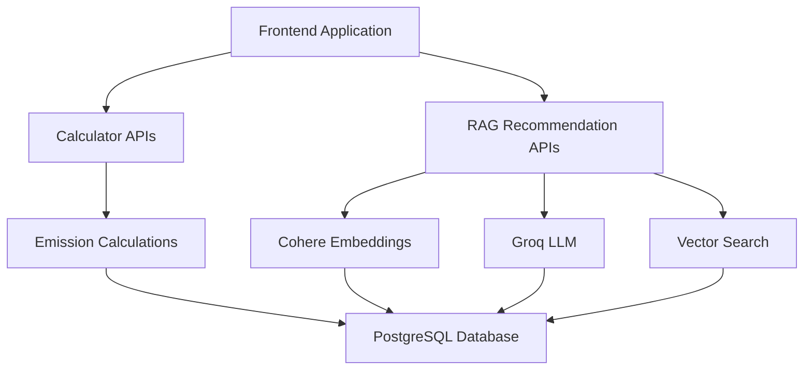

# 📚 GreenPulse Documentation Guides

Welcome to the GreenPulse documentation! This directory contains comprehensive guides for integrating and using the GreenPulse carbon footprint calculator and RAG recommendation system.

## 🎯 Quick Start

### For New Users
1. Start with **[RAG_SETUP_GUIDE.md](./RAG_SETUP_GUIDE.md)** to set up the system
2. Use **[VUE_FRONTEND_INTEGRATION_GUIDE.md](./VUE_FRONTEND_INTEGRATION_GUIDE.md)** for frontend integration
3. Reference **[CALCULATOR_INTEGRATION_GUIDE.md](./CALCULATOR_INTEGRATION_GUIDE.md)** for calculator implementation

### For Developers
- **API Documentation**: [RAG_API_DOCUMENTATION.md](./RAG_API_DOCUMENTATION.md)
- **Calculator APIs**: [CALCULATOR_API_GUIDE.md](./CALCULATOR_API_GUIDE.md)
- **Groq Setup**: [GROQ_SETUP.md](./GROQ_SETUP.md)

## 📋 Guide Overview

### 🚀 **Setup & Configuration**

| Guide | Purpose | Target Audience |
|-------|---------|-----------------|
| **[RAG_SETUP_GUIDE.md](./RAG_SETUP_GUIDE.md)** | Complete RAG system setup | Backend developers, DevOps |
| **[GROQ_SETUP.md](./GROQ_SETUP.md)** | Groq LLM service configuration | AI/ML developers |

### 🔧 **API Documentation**

| Guide | Purpose | Target Audience |
|-------|---------|-----------------|
| **[RAG_API_DOCUMENTATION.md](./RAG_API_DOCUMENTATION.md)** | Complete RAG system API reference | Full-stack developers |
| **[CALCULATOR_API_GUIDE.md](./CALCULATOR_API_GUIDE.md)** | Carbon calculator API endpoints | Frontend developers |

### 🎨 **Frontend Integration**

| Guide | Purpose | Target Audience |
|-------|---------|-----------------|
| **[VUE_FRONTEND_INTEGRATION_GUIDE.md](./VUE_FRONTEND_INTEGRATION_GUIDE.md)** | Vue.js integration with examples | Vue.js developers |
| **[CALCULATOR_INTEGRATION_GUIDE.md](./CALCULATOR_INTEGRATION_GUIDE.md)** | Calculator integration examples | Frontend developers |

## 🌱 **System Architecture**

## 🎯 **Use Cases**

### **Carbon Footprint Calculator**
- Calculate emissions for travel, household, food, and shopping
- Get real-time emission factors
- Display results with charts and summaries

### **AI-Powered Recommendations**
- Generate personalized sustainability recommendations
- Search recommendations by keywords
- Get category-specific advice

### **Full Integration**
- Complete calculator with AI recommendations
- User-friendly interface with loading states
- Error handling and fallbacks

## 🚀 **Getting Started Paths**

### **Path 1: Calculator Only**
1. Read [CALCULATOR_API_GUIDE.md](./CALCULATOR_API_GUIDE.md)
2. Implement calculator endpoints
3. Use [CALCULATOR_INTEGRATION_GUIDE.md](./CALCULATOR_INTEGRATION_GUIDE.md) for frontend

### **Path 2: RAG System Only**
1. Follow [RAG_SETUP_GUIDE.md](./RAG_SETUP_GUIDE.md)
2. Set up [GROQ_SETUP.md](./GROQ_SETUP.md)
3. Use [RAG_API_DOCUMENTATION.md](./RAG_API_DOCUMENTATION.md) for integration

### **Path 3: Complete System**
1. Set up RAG system ([RAG_SETUP_GUIDE.md](./RAG_SETUP_GUIDE.md))
2. Integrate frontend ([VUE_FRONTEND_INTEGRATION_GUIDE.md](./VUE_FRONTEND_INTEGRATION_GUIDE.md))
3. Add calculators ([CALCULATOR_INTEGRATION_GUIDE.md](./CALCULATOR_INTEGRATION_GUIDE.md))

## 📊 **Calculator Types**

### **Travel Calculator**
- Private transport (cars, motorcycles, trucks)
- Public transport (buses, trains, LRT, MRT)
- Flights with class and route information

### **Household Calculator**
- Electricity usage (TNB vs other providers)
- Water consumption and heating
- Gas usage (natural gas vs LPG)
- Waste generation and recycling

### **Food Calculator**
- Meat consumption (beef, pork, chicken, fish)
- Dairy products (milk, cheese, yogurt)
- Fruits and vegetables (local vs imported)
- Eating habits and food waste

### **Shopping Calculator**
- Clothing (new vs second-hand, fast fashion)
- Electronics (lifespan, repair frequency)
- General merchandise (online vs offline)
- Home goods (energy efficiency)

## 🔧 **Technical Stack**

### **Backend**
- Node.js with Express
- PostgreSQL with pgvector
- Cohere AI for embeddings
- Groq for LLM processing

### **Frontend**
- Vue.js (with examples for React/Angular)
- Axios for API calls
- Responsive design
- Accessibility features

### **AI Services**
- **Cohere**: Vector embeddings (1024 dimensions)
- **Groq**: Language model processing
- **pgvector**: Vector similarity search

## 📈 **Features**

### **Core Features**
- ✅ Real-time emission calculations
- ✅ AI-powered recommendations
- ✅ Vector similarity search
- ✅ No user tracking (privacy-focused)
- ✅ Malaysian context and data

### **Advanced Features**
- ✅ Model fallback (primary/backup LLMs)
- ✅ Rate limiting and error handling
- ✅ Caching for performance
- ✅ Progressive enhancement
- ✅ Comprehensive error handling

## 🛠️ **Development Tools**

### **Scripts**
- `npm run setup-rag` - Set up RAG system
- `npm run populate-emission-factors` - Load emission data
- `npm run populate-embeddings` - Generate embeddings
- `npm run dev` - Start development server

### **Testing**
- Health check endpoint: `/api/recommendations/health`
- Test interface: `http://localhost:3001/rag-test.html`
- Calculator test: `http://localhost:3001/calculator-test.html`

## 📞 **Support & Troubleshooting**

### **Common Issues**
1. **API Connection**: Check health endpoint
2. **Embeddings**: Verify pgvector extension
3. **Rate Limits**: Check API key limits
4. **Data Format**: Validate request structure

### **Getting Help**
1. Check the relevant guide for your use case
2. Verify your data structure matches examples
3. Test with the provided test interfaces
4. Check server logs for detailed errors

## 🔄 **Updates & Maintenance**

### **Regular Updates**
- Emission factors updated quarterly
- AI models updated as available
- Security patches applied monthly
- Performance optimizations ongoing

### **Version History**
- **v2.0**: RAG system with no user tracking
- **v1.5**: Added Groq integration
- **v1.0**: Initial calculator system

---

## 🎉 **Ready to Start?**

Choose your path above and dive into the relevant guide. Each guide includes complete examples, error handling, and best practices to get you up and running quickly!

**Happy coding! 🌱✨**
